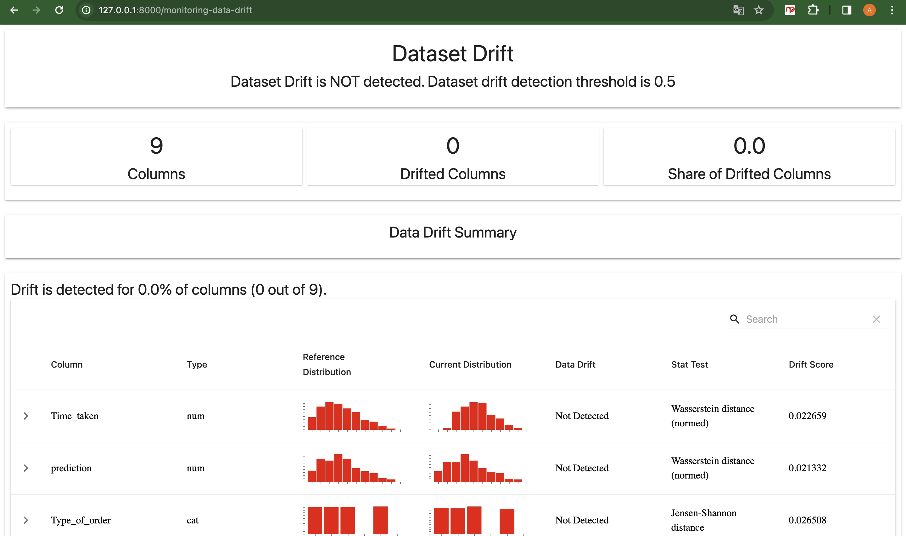
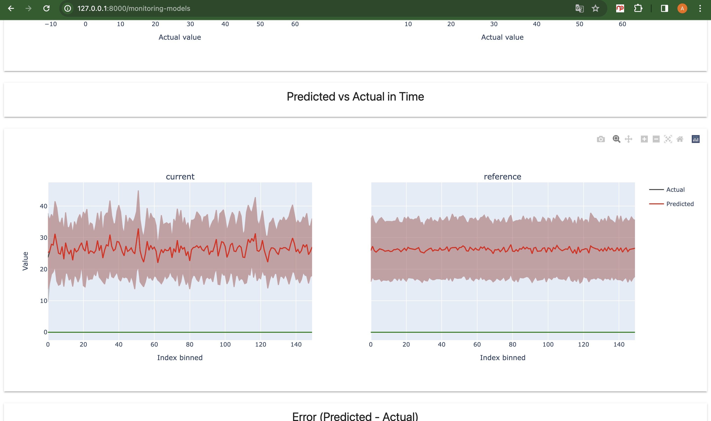

# Prediction Delivery Time

<br />
<div align="center">
  <a href="">
    
  </a>
</div>

<p></p>

<!-- TABLE OF CONTENTS -->
<details>
  <p>
  <summary>Table of Contents</summary>
  <ol>
    <li>
      <a href="#about-the-project">About The Project</a>
      <ul>
        <li><a href="#built-with">Built With</a></li>
      </ul>
    </li>
    <li><a href="#background">Background</a></li>
    <li><a href="#business-values">Business Values</a></li>
    <li><a href="#how-to-works">How to Works</a></li>
    <li><a href="#next-step">Next Step</a></li>
    <li>
      <a href="#mlops-concepts">MLOPS Concepts</a>
      <ul>
        <li><a href="#monitoring-with-evidentlyai">Monitoring with evidentlyAI</a></li>
      </ul>
    </li>
    <li><a href="#aiml-canvas">AI/ML Canvas</a></li>
    <li>
      <a href="#getting-started">Getting Started</a>
      <ul>
        <li><a href="#installation">Installation</a></li>
      </ul>
    </li>
    <li><a href="#license">License</a></li>
  </ol>
  </p>
</details>


<p></p>

<!-- ABOUT THE PROJECT -->
## About The Project

In the food delivery industry, where prompt and accurate delivery is crucial. Delivery time directly affects customer satisfaction and their overall experience. This project can overcome the case. This project predicts food delivery time. The project uses XGboost regression as a model to predict delivery time. This project also includes monitoring machine learning models using evidentlyAI.

### Getting prediction


https://github.com/ALDOPUTRA07/predicition_delivery_time/assets/123882693/d6315e28-3c64-4cdc-b194-319bd05ab545


### Monitoring the model


https://github.com/ALDOPUTRA07/predicition_delivery_time/assets/123882693/33448ad9-c3db-42f4-bf60-fc48ba271ccc


### Built With

These are list any major frameworks/libraries used to make the project.

* [![Pytorch][Pytorch]][Pytorch-url]
* [![postgresql][postgresql]][postgresql-url]
* [![Fastapi][Fastapi]][Fastapi-url]

## Background

In the food delivery industry, where prompt and accurate delivery is crucial, the food delivery time prediction model plays a vital role. Delivery time directly affects customer satisfaction and their overall experience.

## Business Values
The project helps optimize operations, streamline logistics, and meet customer expectations by providing reliable estimates of when the food will be delivered.

## How to Works
This project is an API to get predictions. We can deploy it on the server and send data according to the format to the API, and the API will return the prediction results to the client.

## Next Step 
Based on monitoring the machine learning model, we can retrain it if the model starts to deteriorate.

## MLOPS Concepts
<p align="center">
  
</p>

- **Versioning**. The project includes automated versioning using semantic release Python.
- **CI/CD**. The project uses the CI/CD concept with GitHub action.
- **Testing**. Testing includes data, model, and code testing.
- **Reproducibility**.By monitoring the machine learning model, we can retrain it if the model starts to deteriorate.
- **Monitoring**. For monitoring using evidentlyAI. We monitor 2 things, namely drift data and model performance.

### Monitoring with evidentlyAI
Monitoring data drift
<p align="center">
  
</p>

Monitoring model
<p align="center">
  
</p>


## AI/ML Canvas
Link AI/Canvas for this project. [LINK](https://github.com/ALDOPUTRA07/automated_forecasting/blob/main/static/AI_ML%20Canvas%20Prediction%20Delivery%20Time.pdf)
<p align="center">
  
</p>


<!-- GETTING STARTED -->
## Getting Started
This is a tutorial for running a project locally.

### Installation

1. Clone the repo
   ```sh
   git clone https://github.com/ALDOPUTRA07/prediction_delivery_time
   ```
2. Change to the project directory
   ```sh
   cd prediction_delivery_time
   ```
3. Setting up programming environment to run the project
   ```sh
   poetry shell
   ```
4. Install the dependencies
   ```sh
   poetry install
   ```
5. Running the project (Without 🐳 Docker)
   ```sh
   bash serve/run.sh
   ```

## License
MIT

<p align="right">(<a href="#automed-forecasting">back to top</a>)</p>


<!-- MARKDOWN LINKS & IMAGES -->
<!-- https://www.markdownguide.org/basic-syntax/#reference-style-links -->
[Pytorch]: https://img.shields.io/badge/PyTorch-EE4C2C?style=for-the-badge&logo=pytorch&logoColor=white
[Pytorch-url]: https://pytorch.org/
[postgresql]: https://img.shields.io/badge/PostgreSQL-316192?style=for-the-badge&logo=postgresql&logoColor=white
[postgresql-url]: https://www.postgresql.org/
[Fastapi]: https://img.shields.io/badge/fastapi-109989?style=for-the-badge&logo=FASTAPI&logoColor=white
[Fastapi-url]: https://fastapi.tiangolo.com/
